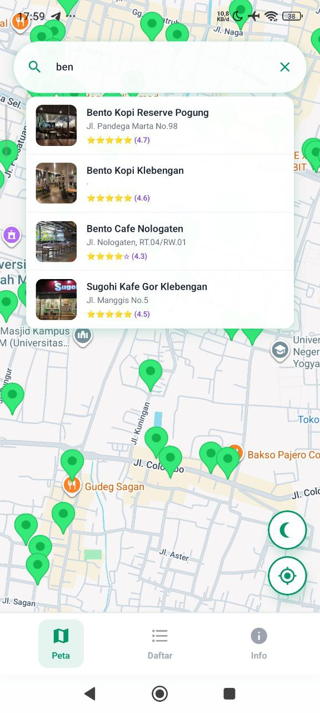
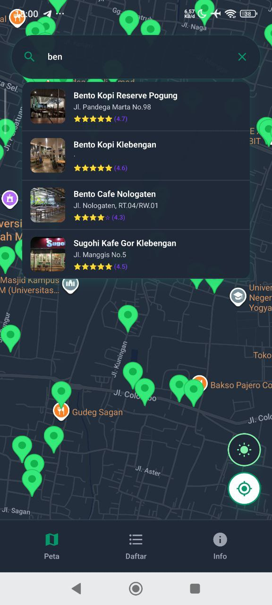
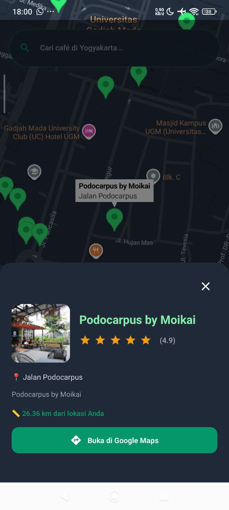
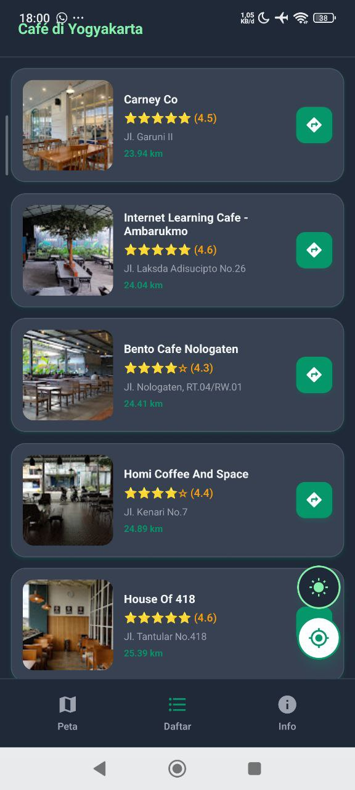

# 🗺️ UGM Nugas Map (React Native Version)

## 📖 Deskripsi Produk

**UGM Nugas Map** adalah aplikasi mobile berbasis peta interaktif yang dirancang khusus untuk membantu mahasiswa Universitas Gadjah Mada (UGM) dan sekitarnya menemukan tempat nugas (café, coffee shop, atau coworking space) yang ideal.

Aplikasi ini dibangun menggunakan **React Native** dan **Expo**, menawarkan pengalaman pengguna yang responsif dan cepat. Fitur utama meliputi pemetaan lokasi café secara visual, perhitungan jarak *real-time* dari posisi pengguna ke lokasi café, pencarian berdasarkan nama atau alamat, serta integrasi navigasi langsung ke Google Maps. Aplikasi ini juga mendukung mode gelap (Dark Mode) untuk kenyamanan penggunaan di malam hari.

## 🛠️ Komponen Pembangun Produk

Aplikasi ini dibangun menggunakan teknologi dan pustaka (library) modern berikut:

### Teknologi Utama
* **Framework:** React Native (v0.81.5)
* **Platform Development:** Expo (v54.0.25)
* **Bahasa Pemrograman:** TypeScript (v5.9.2)

### Library & Modul Penting
1.  **React Native Maps:** Digunakan untuk merender peta interaktif (Google Maps provider pada Android/iOS) dan menampilkan marker lokasi.
2.  **Expo Location:** Mengakses GPS perangkat untuk mendapatkan koordinat pengguna dan menghitung jarak ke café.
3.  **Expo Router:** Menangani navigasi antar layar (Peta, Daftar, Info).
4.  **Vector Icons:** Menggunakan set ikon Material Community untuk antarmuka pengguna.

### Komponen UI (Custom Components)
* `MapScreen.tsx`: Komponen utama yang memuat peta dan logika aplikasi.
* `MapSearchBar.tsx`: Komponen pencarian real-time dengan fitur *auto-complete*.
* `CafeListView.tsx`: Komponen daftar (FlatList) yang menampilkan kartu informasi café dan jarak.
* `BottomNavigation.tsx`: Navigasi bar kustom di bagian bawah layar.
* `InfoModal.tsx`: Layar modal untuk informasi aplikasi.

## 💾 Sumber Data

Data café yang digunakan dalam aplikasi ini (tersimpan dalam `data.json`) diperoleh melalui metode *scraping* data publik.

* **Sumber Asli:** Google Maps
* **Metode Pengambilan:** Menggunakan **Instant Data Scraper**
* **Atribut Data:** Nama, Alamat, Koordinat (Latitude & Longitude), Rating, dan URL Foto.

## 📸 Tangkapan Layar (Screenshots)

Berikut adalah tampilan antarmuka komponen penting dari aplikasi UGM Nugas Map:

### 1. Tampilan Peta & Mode Gelap
Menampilkan peta interaktif dengan marker lokasi café dan posisi pengguna.

| Light Mode | Dark Mode |
|:----------:|:---------:|
|  |  |

### 2. Fitur Pencarian & Detail Lokasi
Pencarian café secara real-time dan tampilan *popup* detail saat marker dipilih.

| Detail Marker |
|:-------------:|
|  |

### 3. Daftar Café (List View)
Daftar café yang diurutkan berdasarkan jarak terdekat dari pengguna.



---

### Cara Menjalankan Aplikasi

1.  Pastikan **Node.js** telah terinstal.
2.  Install dependencies:
    ```bash
    npm install
    ```
3.  Jalankan server development:
    ```bash
    npm start
    ```
4.  Scan QR Code menggunakan aplikasi **Expo Go** di Android/iOS.

---
**Created by:** Frendy Ade Wicaksono
**Course:** Praktikum PGPBL UGM Semester 5